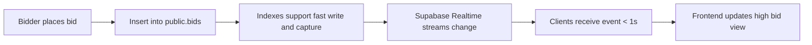

# Silent Auction DB Migrations and Guidance

This document provides concrete SQL migrations and operational guidance to align the database with the app’s functional and non-functional requirements. It focuses on ensuring unique event names, expiring magic links, high-load bidding performance, suggested winners computation, and Supabase Realtime configuration for sub-1s latency.

Environment variables for the frontend container:
- REACT_APP_SUPABASE_URL
- REACT_APP_SUPABASE_KEY

These variables are validated by the frontend at runtime (see src/lib/supabaseClient.js). Apply the following SQL in the Supabase SQL Editor.

## SQL to Enforce Unique Event Names

While the current app prefers joining by code (events.code) for reliability, some requirements call for unique event names. This migration enforces uniqueness on events.name in addition to the existing unique code constraint.

Idempotent migration:

```sql
-- Ensure events table exists with UUID PK and required columns
create extension if not exists "pgcrypto";

create table if not exists public.events (
  id uuid primary key default gen_random_uuid(),
  name text not null,
  code text not null,
  status text default 'active',
  is_open boolean default true not null,
  created_at timestamptz default now()
);

-- Enforce unique name and code (code may already be unique; make idempotent)
do $$
begin
  if not exists (
    select 1 from pg_indexes
    where schemaname = 'public' and tablename = 'events' and indexname = 'events_name_key'
  ) then
    alter table public.events add constraint events_name_key unique (name);
  end if;

  if not exists (
    select 1 from pg_indexes
    where schemaname = 'public' and tablename = 'events' and indexname = 'events_code_key'
  ) then
    alter table public.events add constraint events_code_key unique (code);
  end if;
end $$;
```

Notes:
- If legacy data contains duplicate names, this change will fail. Resolve duplicates first (either rename or consolidate). You can temporarily create a unique index on lower(name) if you want case-insensitive uniqueness:
  - create unique index concurrently if not exists events_name_unique_ci on public.events (lower(name));
  - Then enforce application logic accordingly.

## Create MagicLinks Table with Expiry

Create a table to store magic link tokens or metadata, with a default expiry of 30 days and supporting indexes for cleanup and lookup. This is designed for optional host access or audit purposes and is separate from Supabase Auth’s internal tables.

```sql
create extension if not exists "pgcrypto";

create table if not exists public.magic_links (
  id uuid primary key default gen_random_uuid(),
  event_id uuid not null references public.events(id) on delete cascade,
  email text not null,
  -- token or reference identifier to correlate with email sent (optional in frontend)
  token text unique,
  created_at timestamptz not null default now(),
  expires_at timestamptz not null default (now() + interval '30 days'),
  used_at timestamptz
);

-- Indexes to support lookups and cleanup
create index if not exists magic_links_event_id_idx on public.magic_links(event_id);
create index if not exists magic_links_email_idx on public.magic_links(email);
create index if not exists magic_links_expires_at_idx on public.magic_links(expires_at);

-- Optional: partial index for unexpired, unused tokens (fast validation if used server-side)
create index if not exists magic_links_active_partial_idx
  on public.magic_links (token)
  where used_at is null and expires_at > now();

-- Optional helper functions/triggers for automatic cleanup can be implemented via cron (pg_cron) or external jobs.
```

Operational guidance:
- The frontend currently sends magic links directly via Supabase Auth and does not persist magic_links rows. This table is provided for teams that want an auditable record or a custom flow. You can instrument your backend to insert a row when issuing a magic link.
- For strict security, do not store raw tokens; store only hashed tokens (e.g., digest) and compare hashes on verification.

## Indexes and Constraints for High-Load Bidding

For scalability to 1000 bidders per event and to reduce contention, ensure the following indexes exist. These are already present in the baseline schema, but we include idempotent migrations to enforce and extend for performance.

```sql
-- ITEMS table and indexes
create table if not exists public.items (
  id uuid primary key default gen_random_uuid(),
  event_id uuid not null references public.events(id) on delete cascade,
  title text not null,
  description text default '',
  starting_bid numeric default 0,
  created_at timestamptz default now()
);

create index if not exists items_event_id_idx on public.items(event_id);
create index if not exists items_created_at_idx on public.items(created_at);

-- BIDS table and indexes
create table if not exists public.bids (
  id uuid primary key default gen_random_uuid(),
  event_id uuid not null references public.events(id) on delete cascade,
  item_id uuid not null references public.items(id) on delete cascade,
  amount numeric not null check (amount > 0),
  bidder_name text default 'Anonymous',
  created_at timestamptz default now()
);

-- Key indexes for high-traffic reads/writes
create index if not exists bids_item_id_idx on public.bids(item_id);
create index if not exists bids_event_id_idx on public.bids(event_id);
create index if not exists bids_item_amount_desc_idx on public.bids(item_id, amount desc);
create index if not exists bids_item_created_at_desc_idx on public.bids(item_id, created_at desc);

-- Optional: lightweight covering index for frequently accessed fields
-- Adjust column list to match your read patterns
create index if not exists bids_item_cover_idx on public.bids(item_id, amount, created_at);
```

Additional integrity options (optional, recommended with server-side enforcement):
- To enforce strictly increasing bids at the database level, implement a trigger on bids that checks new.amount > GREATEST(item.starting_bid, current_high_bid_for_item). This requires a stable read inside a transaction and may use advisory locks to avoid race conditions at very high concurrency.

Example trigger function (illustrative):

```sql
-- Ensure only strictly higher bids are accepted.
-- Note: This simplistic version does not serialize concurrent writes; for extreme concurrency,
-- consider pg_advisory_xact_lock or SERIALIZABLE isolation with retry logic at the application layer.
create or replace function public.enforce_higher_bids()
returns trigger
language plpgsql
as $$
declare
  current_high numeric;
  start_bid numeric;
begin
  select starting_bid into start_bid from public.items where id = new.item_id for update;
  select max(amount) into current_high from public.bids where item_id = new.item_id;

  if new.amount <= coalesce(greatest(coalesce(current_high, 0), coalesce(start_bid, 0)), 0) then
    raise exception 'Bid must be greater than current price';
  end if;

  return new;
end;
$$;

drop trigger if exists bids_enforce_higher on public.bids;
create trigger bids_enforce_higher
before insert on public.bids
for each row
execute function public.enforce_higher_bids();
```

If you need strong guarantees under heavy concurrent bidding, wrap the check+insert in a single function using advisory locks or SERIALIZABLE transactions and call it via RPC.

## Optional Triggers or Views for Winner Calculation

When an event closes, hosts need winners for each item. You can compute winners on-demand with a query or maintain a materialized view for fast access.

Option A: On-demand query (simple and fresh)

```sql
-- Highest bid per item within an event, including bidder details.
-- Returns one row per item with its highest bid (if any).
with ranked as (
  select
    b.*,
    row_number() over (partition by b.item_id order by b.amount desc, b.created_at asc) as rn
  from public.bids b
  where b.event_id = $1  -- replace with your event_id
)
select
  i.id as item_id,
  i.title,
  i.starting_bid,
  r.id as winning_bid_id,
  r.amount as winning_amount,
  r.bidder_name,
  r.created_at as bid_time
from public.items i
left join ranked r on r.item_id = i.id and r.rn = 1
where i.event_id = $1
order by i.created_at asc;
```

Option B: Materialized view for fast dashboard access (refresh on close)

```sql
-- Create materialized view for winners per item.
drop materialized view if exists public.suggested_winners;
create materialized view public.suggested_winners as
with ranked as (
  select
    b.*,
    row_number() over (partition by b.item_id order by b.amount desc, b.created_at asc) as rn
  from public.bids b
)
select
  i.event_id,
  i.id as item_id,
  i.title,
  i.starting_bid,
  r.id as winning_bid_id,
  r.amount as winning_amount,
  r.bidder_name,
  r.created_at as bid_time
from public.items i
left join ranked r on r.item_id = i.id and r.rn = 1;

-- Indexes to accelerate filtering by event
create index if not exists suggested_winners_event_id_idx on public.suggested_winners(event_id);

-- On event close, refresh only the relevant event slice, or do a full refresh if acceptable:
-- Full refresh (simple):
--   refresh materialized view concurrently public.suggested_winners;
-- Event-scoped incremental refresh pattern:
--   Consider replacing the MV with a standard view + a cache table that you repopulate per event.
```

Option C: Winners table persisted at close (immutable snapshot)

If you want an immutable record of winners at the moment an event closes, create a winners table and populate it when status transitions to closed:

```sql
create table if not exists public.winners (
  id uuid primary key default gen_random_uuid(),
  event_id uuid not null references public.events(id) on delete cascade,
  item_id uuid not null references public.items(id) on delete cascade,
  winning_bid_id uuid references public.bids(id),
  winning_amount numeric,
  bidder_name text,
  finalized_at timestamptz not null default now(),
  unique(event_id, item_id)
);

-- Populate on close (run this in a transaction right after setting events.status='closed'):
with ranked as (
  select
    b.*,
    row_number() over (partition by b.item_id order by b.amount desc, b.created_at asc) as rn
  from public.bids b
  where b.event_id = $1  -- event_id
),
w as (
  select
    i.event_id,
    i.id as item_id,
    r.id as winning_bid_id,
    r.amount as winning_amount,
    r.bidder_name
  from public.items i
  left join ranked r on r.item_id = i.id and r.rn = 1
  where i.event_id = $1
)
insert into public.winners (event_id, item_id, winning_bid_id, winning_amount, bidder_name)
select event_id, item_id, winning_bid_id, winning_amount, bidder_name
from w
on conflict (event_id, item_id) do update
set winning_bid_id = excluded.winning_bid_id,
    winning_amount = excluded.winning_amount,
    bidder_name = excluded.bidder_name,
    finalized_at = now();
```

Choose A if you prefer simplicity, B for faster repeated reads with manual refresh, or C for an auditable immutable snapshot.

## Supabase Realtime Tuning Checklist (Sub-1s Latency)

To target sub-1s end-to-end bid propagation to all clients:

1) Enable Realtime for required tables
- In Supabase Dashboard > Realtime, enable database changes (INSERT/UPDATE/DELETE) for:
  - public.items
  - public.bids
  - public.events

2) Use filtered channels in the client
- The frontend subscribes with per-event or per-item filters:
  - items: filter event_id=eq.{eventId}
  - bids: filter item_id=eq.{itemId}
  - events: filter id=eq.{eventId}
- See src/services/auctionService.js (subscribeToItems, subscribeToBids, subscribeToEvent)

3) Keep payloads small
- The app primarily listens for changes and refetches targeted rows only when needed (e.g., reload high bid). This reduces bandwidth and processing on the client.

4) Index for fast replication capture
- Ensure indexes on join/filter keys:
  - items(event_id)
  - bids(item_id), bids(event_id)
  - events(id)
- These are included in the migrations above.

5) Scale considerations
- For very large events (1000+ bidders), keep per-item subscriptions limited to items visible on screen to reduce channel count (the app already attaches per-item bid subscriptions only for the current item list).
- Consider server-side rate-limiting or batching for administrative bulk updates.

6) Client observation
- The app shows a quick toast on successful bid and also refetches the latest high bid for robustness in case realtime propagation is slightly delayed.

7) Network and region
- Deploy the app close to Supabase region to minimize RTT.
- Ensure stable client connections (avoid aggressive browser sleep; keep tabs active during critical phases).

## Existing Schema and Patches (Reference)

- Base schema and RLS policies: react_frontend/assets/supabase_schema.sql
- Idempotent patches:
  - Ensure events.is_open: react_frontend/assets/sql_patches/events_is_open_patch.sql
  - Ensure items.id is UUID with default: react_frontend/assets/sql_patches/items_id_uuid_patch.sql

These are already aligned with the frontend logic:
- events.id, items.id, bids.id are UUIDs with defaults created by the DB.
- The app never supplies id on inserts; the database generates it.
- Auction status is tracked via events.status and optionally events.is_open; frontend handles both.

## Rollout Plan

Recommended order in production:

1) Apply non-breaking index additions (bids and items extra indexes).
2) Create magic_links table and indexes (optional if you adopt this pattern).
3) Enforce unique events.name:
   - Run a report to find duplicates: select name, count(*) from public.events group by name having count(*) > 1;
   - Resolve duplicates (rename or merge).
   - Apply the uniqueness constraint.
4) Implement winner calculation approach (A, B, or C). If using B (materialized view), schedule refresh on event close. If using C (winners table), implement the transaction logic that writes winners at close.
5) Verify Realtime replication is enabled and filters are applied on the frontend.
6) Load test critical flows (event with 1000+ bidders) focusing on bidding latency.

## Appendix: Quick Verification Queries

- Ensure unique names and codes:
```sql
-- Should return 0 rows
select name from public.events group by name having count(*) > 1;
select code from public.events group by code having count(*) > 1;
```

- Validate items and bids indexes exist:
```sql
select indexname from pg_indexes where tablename in ('items', 'bids') and schemaname='public';
```

- Confirm realtime-enabled tables are configured in Supabase dashboard:
  - Check Realtime > Replication settings for public.items, public.bids, public.events.



Sources of truth and related files:
- react_frontend/assets/supabase_schema.sql
- react_frontend/assets/sql_patches/events_is_open_patch.sql
- react_frontend/assets/sql_patches/items_id_uuid_patch.sql
- react_frontend/assets/supabase.md
- react_frontend/src/services/auctionService.js
- react_frontend/src/lib/supabaseClient.js
